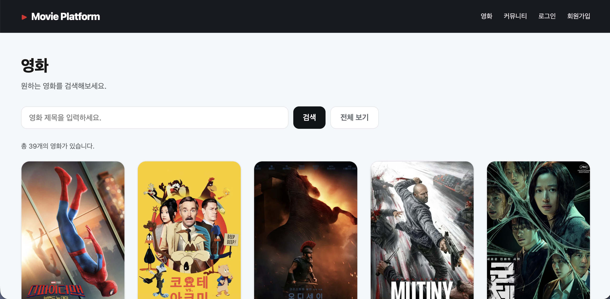
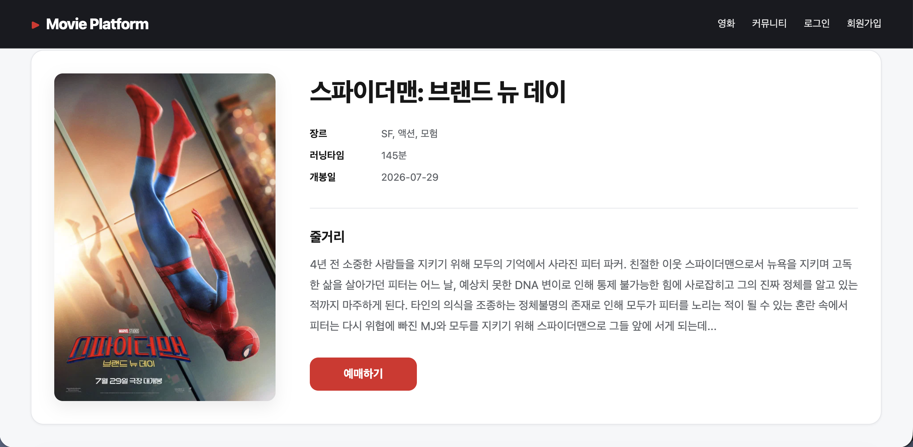
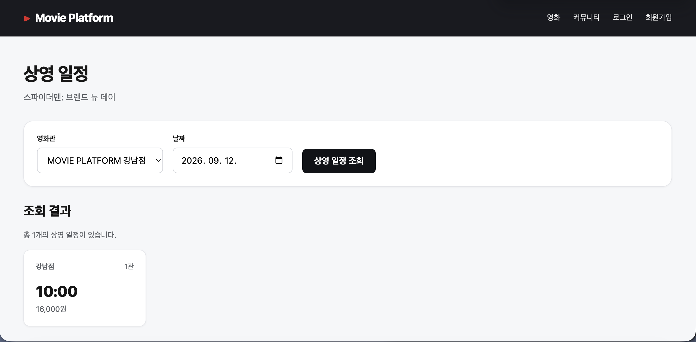
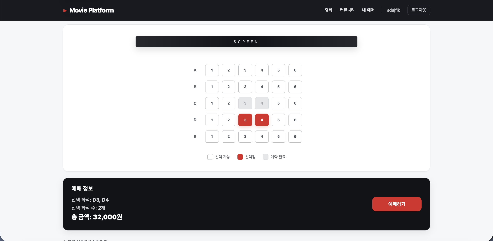
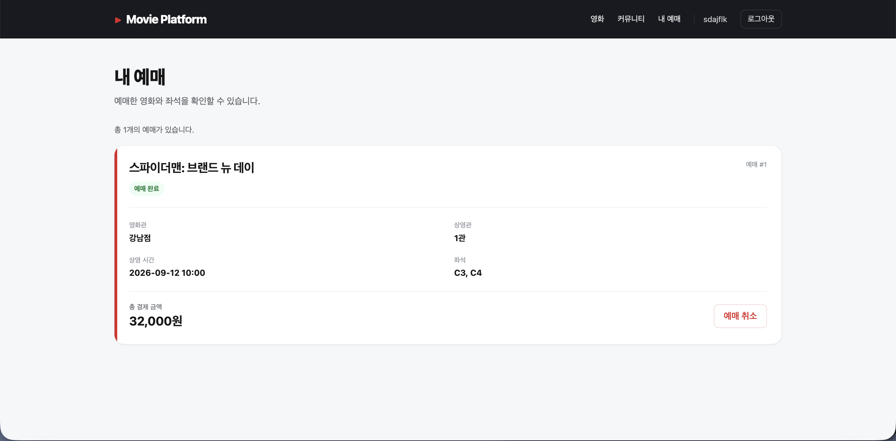
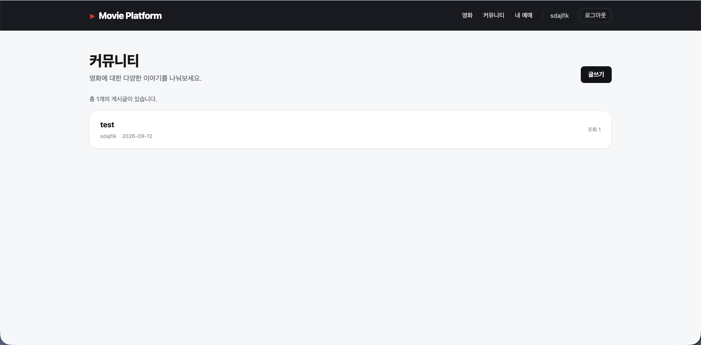
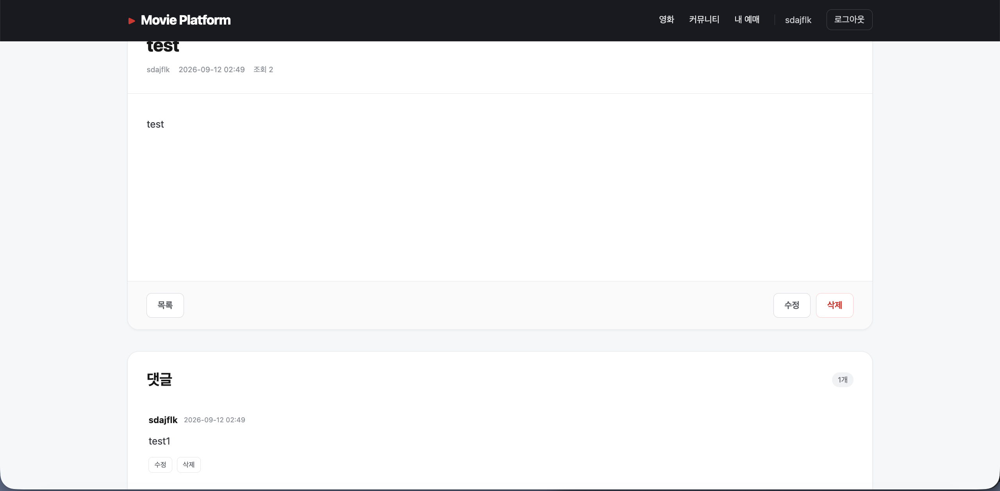

# Movie Platform

영화 정보 탐색부터 상영 일정 조회, 좌석 선택 및 예매, 리뷰와 커뮤니티까지 제공하는 영화 플랫폼입니다.

TMDB API를 활용해 영화 정보를 제공하며, Spring Boot 기반 REST API와 React 프론트엔드를 연동했습니다.  
또한 동일 좌석에 대한 동시 예매 문제를 방지하기 위해 DB 비관적 락을 적용했습니다.

---

## 1. 주요 기능

### 영화

- TMDB API 기반 인기 영화 조회
- 영화 상세 정보 조회
- TMDB 영화 데이터 MySQL 저장
- 영화 목록 및 제목 검색

### 회원 / 인증

- 회원가입 / 로그인
- BCrypt 비밀번호 암호화
- JWT Access Token 기반 인증
- 로그인 사용자 정보 조회

### 영화관 / 상영 정보

- 영화관 및 상영관 조회
- 영화별 / 영화관별 / 날짜별 상영 일정 조회
- 상영관 좌석 정보 조회
- 좌석별 가격 및 예약 상태 관리

### 예매

- 상영 일정 및 좌석 선택
- 여러 좌석 동시 예매
- 예매 금액 계산
- 예매 내역 조회 및 취소
- `PESSIMISTIC_WRITE`를 이용한 동시 예매 방지

### 리뷰

- 영화별 리뷰 조회
- 리뷰 작성 / 수정 / 삭제
- 평점 1~5 검증
- 동일 사용자의 중복 리뷰 방지
- 작성자 권한 검증

### 커뮤니티

- 게시글 작성 / 조회 / 수정 / 삭제
- 게시글 조회수 증가
- 댓글 작성 / 조회 / 수정 / 삭제
- 작성자 권한 검증

---

## 2. 서비스 화면

### 영화 목록



### 영화 상세



### 상영 일정



### 좌석 선택



### 예매 내역



### 커뮤니티





---

## 3. 기술 스택

### Backend

- Java 21
- Spring Boot 4.1.1
- Spring Web
- Spring Data JPA
- Spring Security
- JWT
- Bean Validation
- Gradle

### Frontend

- React
- Vite
- React Router
- Axios

### Database

- MySQL

### External API

- TMDB API

### Deployment

- Frontend: Vercel
- Backend: Railway
- Database: Railway MySQL

> Vercel과 Railway를 이용한 실제 배포 및 프론트엔드-백엔드 연동을 완료했습니다.  
> 현재 공개 배포 환경은 무료 사용 한도에 따라 일시적으로 비활성화될 수 있습니다.

---

## 4. 시스템 구조

```text
                  ┌──────────────┐
                  │    Client    │
                  └──────┬───────┘
                         │
                         ▼
                ┌────────────────┐
                │ React + Vite   │
                │    Frontend    │
                └───────┬────────┘
                        │ REST API
                        ▼
              ┌─────────────────────┐
              │ Spring Boot Backend │
              └──────┬────────┬─────┘
                     │        │
                JPA  │        │ REST API
                     ▼        ▼
              ┌──────────┐  ┌──────────┐
              │  MySQL   │  │ TMDB API │
              └──────────┘  └──────────┘
```

배포 환경에서는 React 프론트엔드를 Vercel에, Spring Boot와 MySQL을 Railway에 배포했습니다.

---

## 5. 핵심 구현

### 좌석 동시 예매 방지

예매 과정에서 여러 사용자가 같은 좌석을 동시에 선택할 경우 중복 예매가 발생할 수 있습니다.

이를 방지하기 위해 예매 처리 시 `ScheduleSeat`을 조회할 때 DB 비관적 락인 `PESSIMISTIC_WRITE`를 적용했습니다.

```text
사용자 예매 요청
      │
      ▼
ScheduleSeat 조회
      │
      ▼
PESSIMISTIC_WRITE Lock
      │
      ▼
좌석 상태 AVAILABLE 확인
      │
      ▼
Reservation 생성
      │
      ▼
ReservationSeat 생성
      │
      ▼
AVAILABLE → RESERVED
```

하나의 트랜잭션이 좌석을 처리하는 동안 다른 트랜잭션이 동일한 좌석을 동시에 변경하지 못하도록 하여 중복 예매를 방지합니다.

예매 취소 시에는 해당 좌석의 상태를 다시 `AVAILABLE`로 변경합니다.

---

### JWT 인증

로그인 성공 시 JWT Access Token을 발급하고 클라이언트에서 저장합니다.

인증이 필요한 요청에는 다음과 같이 토큰을 전달합니다.

```text
Authorization: Bearer {accessToken}
```

Spring Security의 JWT 필터에서 토큰을 검증하고 인증된 사용자의 정보를 `SecurityContext`에 저장합니다.

```text
로그인
  │
  ▼
JWT 발급
  │
  ▼
클라이언트 저장
  │
  ▼
Authorization Header
  │
  ▼
JwtAuthenticationFilter
  │
  ▼
SecurityContext
  │
  ▼
인증 API 접근
```

---

### TMDB API 연동

TMDB API의 영화 정보를 Spring `RestClient`를 통해 조회합니다.

```text
TMDB API
   │
   ▼
TmdbClient
   │
   ▼
MovieService
   │
   ▼
MySQL movies
   │
   ▼
React Frontend
```

TMDB의 API Read Access Token은 환경 변수로 관리하여 소스 코드와 GitHub 저장소에 노출되지 않도록 구성했습니다.

---

## 6. 주요 데이터 구조

```text
User
 ├── Reservation
 │    └── ReservationSeat
 │          └── ScheduleSeat
 │                └── Seat
 ├── Review
 ├── Post
 └── Comment

Movie
 ├── Schedule
 └── Review

Theater
 └── Screen
      ├── Seat
      └── Schedule

Schedule
 └── ScheduleSeat
```

주요 테이블:

```text
users
movies
theaters
screens
seats
schedules
schedule_seats
reservations
reservation_seats
reviews
posts
comments
```

---

## 7. 주요 API

### Auth

| Method | Endpoint | 설명 | 인증 |
|---|---|---|---|
| POST | `/api/auth/signup` | 회원가입 | X |
| POST | `/api/auth/login` | 로그인 및 JWT 발급 | X |
| GET | `/api/users/me` | 내 정보 조회 | JWT |

### Movie / TMDB

| Method | Endpoint | 설명 | 인증 |
|---|---|---|---|
| GET | `/api/tmdb/popular` | TMDB 인기 영화 조회 | X |
| GET | `/api/tmdb/movies/{movieId}` | TMDB 영화 상세 조회 | X |
| POST | `/api/tmdb/movies/{movieId}/save` | TMDB 영화 DB 저장 | X |
| GET | `/api/movies` | 영화 목록 / 검색 | X |
| GET | `/api/movies/{movieId}` | 영화 상세 조회 | X |

### Theater / Schedule

| Method | Endpoint | 설명 | 인증 |
|---|---|---|---|
| GET | `/api/theaters` | 영화관 목록 | X |
| GET | `/api/theaters/{theaterId}/screens` | 상영관 목록 | X |
| GET | `/api/screens/{screenId}/seats` | 좌석 조회 | X |
| GET | `/api/schedules` | 상영 일정 조회 | X |
| GET | `/api/schedules/{scheduleId}/seats` | 상영별 좌석 조회 | X |

### Reservation

| Method | Endpoint | 설명 | 인증 |
|---|---|---|---|
| POST | `/api/reservations` | 예매 | JWT |
| GET | `/api/reservations/me` | 내 예매 조회 | JWT |
| PATCH | `/api/reservations/{reservationId}/cancel` | 예매 취소 | JWT |

### Review / Community

| Method | Endpoint | 설명 | 인증 |
|---|---|---|---|
| GET | `/api/movies/{movieId}/reviews` | 리뷰 조회 | X |
| POST | `/api/movies/{movieId}/reviews` | 리뷰 작성 | JWT |
| GET | `/api/posts` | 게시글 목록 | X |
| GET | `/api/posts/{postId}` | 게시글 상세 | X |
| POST | `/api/posts` | 게시글 작성 | JWT |
| POST | `/api/posts/{postId}/comments` | 댓글 작성 | JWT |

---

## 8. 프로젝트 구조

```text
movie-platform/
├── backend/
│   └── src/
│       ├── main/
│       │   ├── java/com/movieplatform/backend/
│       │   │   ├── client/
│       │   │   ├── config/
│       │   │   ├── controller/
│       │   │   ├── dto/
│       │   │   ├── entity/
│       │   │   ├── exception/
│       │   │   ├── repository/
│       │   │   ├── security/
│       │   │   └── service/
│       │   └── resources/
│       └── test/
│
├── frontend/
│   ├── src/
│   │   ├── api/
│   │   ├── components/
│   │   └── pages/
│   └── package.json
│
├── screenshots/
│   ├── movie-list.png
│   ├── movie-detail.png
│   ├── schedule.png
│   ├── seat-selection.png
│   ├── reservation.png
│   └── community.png
│
└── README.md
```

---

## 9. 로컬 실행

### MySQL

MySQL 실행:

```bash
brew services start mysql
```

데이터베이스가 없는 경우:

```sql
CREATE DATABASE movie_platform
CHARACTER SET utf8mb4
COLLATE utf8mb4_unicode_ci;
```

### Backend 환경 변수

```bash
export MYSQLHOST=localhost
export MYSQLPORT=3306
export MYSQLDATABASE=movie_platform
export MYSQLUSER=root
export MYSQLPASSWORD='YOUR_MYSQL_PASSWORD'

export TMDB_ACCESS_TOKEN='YOUR_TMDB_API_READ_ACCESS_TOKEN'
export JWT_SECRET='YOUR_JWT_SECRET'
```

JWT Secret 생성 예시:

```bash
openssl rand -base64 32
```

### Backend 실행

```bash
cd backend
./gradlew bootRun
```

Backend:

```text
http://localhost:8080
```

### Frontend 실행

```bash
cd frontend
npm install
VITE_API_BASE_URL=http://localhost:8080/api npm run dev
```

Frontend:

```text
http://localhost:5173
```

---

## 10. 환경 변수

Backend:

```text
MYSQLHOST
MYSQLPORT
MYSQLDATABASE
MYSQLUSER
MYSQLPASSWORD
TMDB_ACCESS_TOKEN
JWT_SECRET
```

Frontend:

```text
VITE_API_BASE_URL
```

DB 비밀번호, JWT Secret, TMDB Access Token 등 민감한 값은 GitHub에 커밋하지 않습니다.

---

## 11. 개선 예정

- Refresh Token 도입
- 관리자 기능
- 결제 기능
- 영화 / 게시글 페이지네이션 고도화
- 테스트 코드 보강
- CI/CD 및 배포 환경 개선

---

## 12. 프로젝트를 통해 다룬 내용

Spring Boot 기반 REST API 개발부터 React 프론트엔드 연동, MySQL 데이터 모델링, JWT 인증, 외부 API 연동, 동시성 제어와 실제 배포까지 웹 서비스의 전체 흐름을 구현했습니다.

특히 예매 서비스에서 발생할 수 있는 동일 좌석의 동시 접근 문제를 DB 비관적 락을 이용해 처리하면서 트랜잭션과 동시성 제어를 실제 기능에 적용했습니다.

